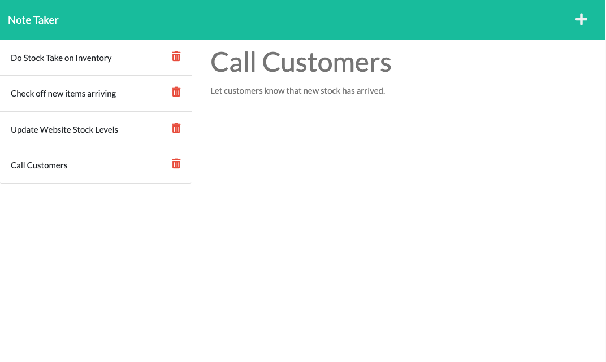

# Note Take - Online Notes App 

[Deployed Here!](https://sheltered-chamber-34158.herokuapp.com/notes)
## Description
This app allows the user to create and save notes online through a web browser. The user can create a note by inputting a title and body to the note and pressing the save icon to save the note. The note can then be recalled by clicking the note in the sidebar.

## Table of Contents
  [Description](#description)

  [Installation](#installation)

  [Questions](#questions)
  
  [License](#license)

## Installation
This is an application deployed online on [Heroku](https://sheltered-chamber-34158.herokuapp.com/notes).

## Questions
Created by [RyanMcd29](https://github.com/RyanMcd29).
If you have any questions about this project please contact me at [ryan.mcdiarmid45@gmail.com](mailto:ryan.mcdiarmid45@gmail.com).

## License
Licensed for use under <a href=https://opensource.org/licenses/MIT>MIT</a> for more information please see [license](./license) in repo.
